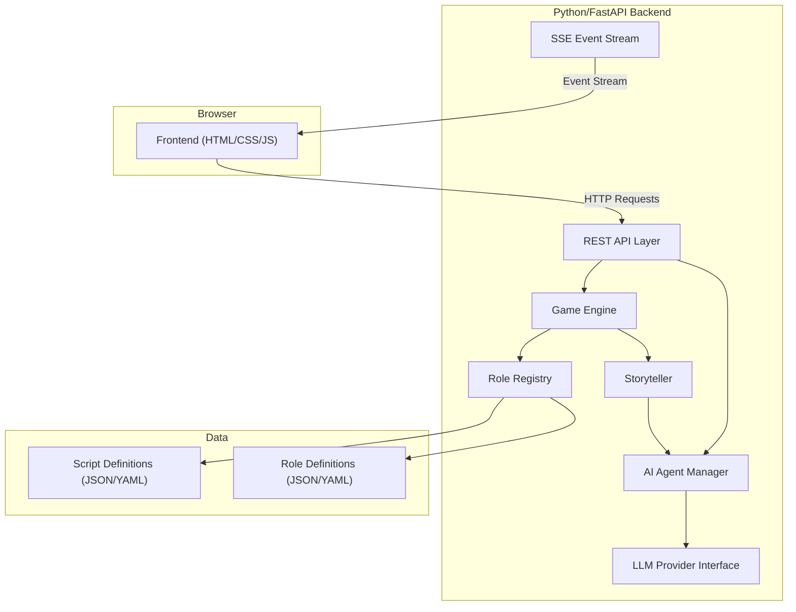
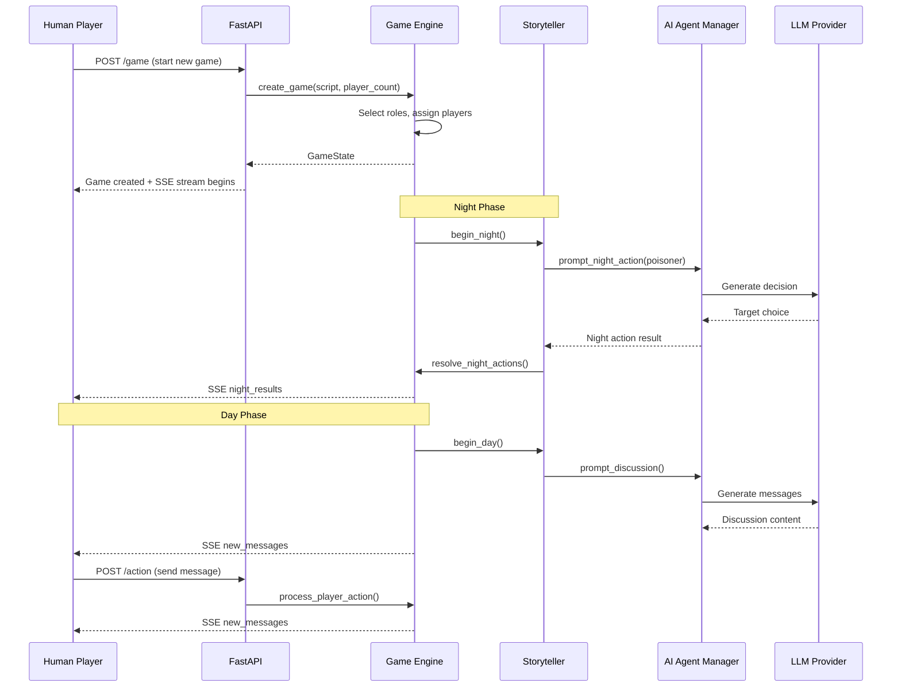
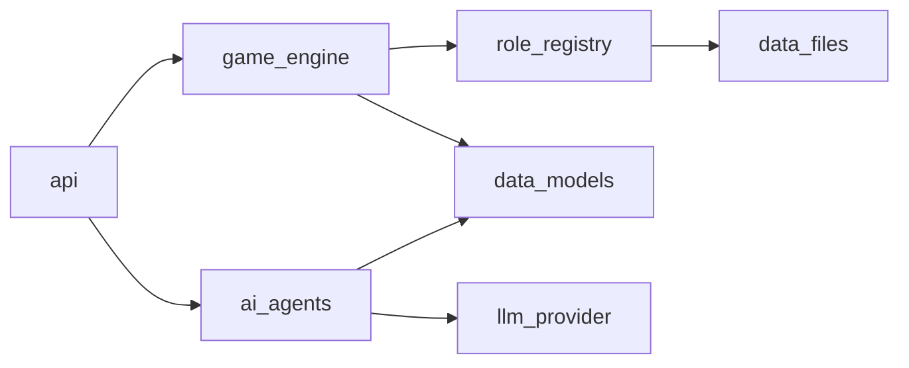

# Design Document: Blood on the Clocktower AI

## Overview

This document describes the technical design for an AI-powered Blood on the Clocktower (BotC) game application. The system enables a single human player to play alongside 4-6 AI agents in a complete game of Trouble Brewing, the introductory edition.

The architecture separates concerns into three primary layers:

1. **Game Engine** — Manages game state (the Grimoire), enforces rules, resolves night actions, tracks win conditions
2. **AI/LLM Integration** — Powers AI agent decision-making, discussion, and deception through an abstracted LLM interface
3. **Frontend Communication** — Delivers game state and events to the browser via REST API + Server-Sent Events (SSE)

The system is designed for extensibility: roles are data-driven (JSON/YAML), scripts compose roles into playable configurations, and the LLM provider is behind an interface so models can be swapped without engine changes.

Key game mechanics faithfully implemented from official rules:
- **Conditional evil knowledge**: In games with 7+ players, evil team members know each other; in smaller games they do not. The Demon also receives 3 "bluff" characters (not-in-play good roles) to assist deception.
- **Day discussion**: All players (alive and dead) participate in discussion.
- **Vote tokens**: Dead players receive one vote token upon death, usable in exactly one future nomination vote.
- **Nomination limits**: Each alive player may nominate at most once per day; each player may be nominated at most once per day.
- **About-to-die tracking**: Multiple nominations occur per day; the nominee with the most qualifying votes (at or above threshold) is marked "about to die" and executed at end of day. Ties result in no execution.
- **Execution threshold**: Votes must be at least half the alive player count (rounded up), not strict majority.
- **Poison lifts on Poisoner death**: If the Poisoner dies at any point, their active poison immediately ends.

## Architecture

### High-Level System Architecture



### Request/Response Flow



### Module Dependency Diagram



## Components and Interfaces

### 1. Game Engine (`game_engine/`)

The core module that manages all game state and rule enforcement.

#### Key Classes and Interfaces

```python
# game_engine/engine.py

class GameEngine:
    """Central orchestrator for game state and rule enforcement."""
    
    def create_game(self, script_name: str, player_count: int, human_player_name: str) -> GameSession:
        """Initialize a new game session with role assignment.
        
        Selects roles from the script, assigns them randomly, and distributes
        evil team knowledge conditionally:
        - 7+ players: Minions learn Demon ID, Demon learns Minion IDs + 3 Demon_Bluffs
        - <7 players: No evil team knowledge distributed
        """
        ...
    
    def begin_night_phase(self, session: GameSession) -> NightPhaseContext:
        """Transition to night, prepare night action queue."""
        ...
    
    def resolve_night_action(self, session: GameSession, player_id: str, action: NightAction) -> NightActionResult:
        """Process a single night action and update state.
        
        If the Poisoner dies (any cause), immediately lifts active poison.
        """
        ...
    
    def complete_night_phase(self, session: GameSession) -> NightSummary:
        """Finalize all night actions, announce deaths.
        
        When marking players as dead, grants them a Vote_Token.
        If the dying player is the Poisoner, immediately lifts any active poison.
        """
        ...
    
    def begin_day_phase(self, session: GameSession) -> DayPhaseContext:
        """Transition to day phase, enable discussion.
        
        Resets daily nomination tracking: nominators_today, nominees_today,
        about_to_die_player_id, about_to_die_votes. All players (alive and dead)
        may participate in discussion.
        """
        ...
    
    def nominate(self, session: GameSession, nominator_id: str, target_id: str) -> Nomination:
        """Process a nomination for execution.
        
        Validates:
        - Only alive players may nominate
        - Each alive player may nominate at most once per day
        - Each player (alive or dead) may be nominated at most once per day
        """
        ...
    
    def cast_vote(self, session: GameSession, voter_id: str, nomination_id: str, vote: bool) -> VoteResult:
        """Record a player's vote on active nomination.
        
        Eligible voters: all alive players + dead players who still have their Vote_Token.
        Dead players who use their token have it spent permanently.
        Butler voting restriction still applies.
        """
        ...
    
    def resolve_nomination(self, session: GameSession, nomination_id: str) -> NominationResult:
        """Tally votes and update about_to_die tracking.
        
        Threshold: votes >= ceil(alive_count / 2).
        If votes meet threshold AND exceed current about_to_die_votes,
        update about_to_die_player_id. Does NOT execute immediately.
        If tied with current about_to_die, clears about_to_die (no execution).
        """
        ...
    
    def end_day_phase(self, session: GameSession) -> Optional[str]:
        """Execute the about_to_die player at end of day.
        
        If about_to_die_player_id is set, executes that player (marks as DEAD,
        grants Vote_Token). Returns the executed player_id or None.
        If Poisoner is executed, immediately lifts active poison.
        """
        ...
    
    def use_day_ability(self, session: GameSession, player_id: str, target_id: str) -> DayAbilityResult:
        """Handle day abilities like the Slayer's shot."""
        ...
    
    def check_win_condition(self, session: GameSession) -> Optional[GameResult]:
        """Evaluate if either team has won."""
        ...
```

```python
# game_engine/storyteller.py

class Storyteller:
    """Automated game master that orchestrates flow and resolves information."""
    
    def __init__(self, engine: GameEngine, agent_manager: AIAgentManager):
        ...
    
    async def run_night_phase(self, session: GameSession) -> NightSummary:
        """Execute full night phase: prompt each role in order, resolve."""
        ...
    
    async def run_day_phase(self, session: GameSession) -> DaySummary:
        """Manage discussion rounds, nominations, voting.
        
        All players (alive and dead) participate in discussion.
        Multiple nominations may occur. At day's end, the about_to_die
        player is executed (if any).
        """
        ...
    
    def get_night_order(self, session: GameSession, is_first_night: bool) -> list[str]:
        """Return ordered list of player_ids who act this night."""
        ...
    
    def generate_info_for_role(self, session: GameSession, player_id: str) -> RoleInformation:
        """Produce the information a role receives (accounting for poison)."""
        ...
```

### 2. Role Registry (`role_registry/`)

Loads and manages role/script data from structured files.

```python
# role_registry/registry.py

class RoleRegistry:
    """Loads and provides access to role definitions and scripts."""
    
    def __init__(self, data_dir: str):
        """Load all role definitions and scripts from data directory."""
        ...
    
    def get_role(self, role_name: str) -> RoleDefinition:
        """Retrieve a role definition by name."""
        ...
    
    def get_script(self, script_name: str) -> Script:
        """Retrieve a script (list of available roles) by name."""
        ...
    
    def get_roles_for_player_count(self, script: Script, player_count: int) -> RoleDistribution:
        """Determine how many of each type to include for a given count."""
        ...
    
    def select_roles(self, script: Script, distribution: RoleDistribution) -> list[RoleDefinition]:
        """Randomly select specific roles matching the distribution."""
        ...
```

### 3. AI Agent Manager (`ai_agents/`)

Manages AI player instances and coordinates their interactions with the LLM.

```python
# ai_agents/manager.py

class AIAgentManager:
    """Coordinates all AI agents in the game."""
    
    def __init__(self, llm_provider: LLMProvider):
        ...
    
    def create_agents(self, session: GameSession, ai_players: list[Player]) -> dict[str, AIAgent]:
        """Instantiate AI agents for all non-human players."""
        ...
    
    async def get_night_action(self, agent_id: str, context: NightActionContext) -> NightAction:
        """Prompt an AI agent to make their night choice."""
        ...
    
    async def generate_discussion_messages(self, agent_id: str, context: DiscussionContext) -> list[Message]:
        """Generate discussion messages for a specific AI agent."""
        ...
    
    async def get_vote_decision(self, agent_id: str, context: VoteContext) -> bool:
        """Ask an AI agent to decide their vote."""
        ...
    
    async def get_nomination_decision(self, agent_id: str, context: NominationContext) -> Optional[str]:
        """Ask if an AI agent wants to nominate someone."""
        ...
```

```python
# ai_agents/agent.py

class AIAgent:
    """A single AI player with persistent state and personality."""
    
    def __init__(self, player: Player, personality: Personality, llm_provider: LLMProvider):
        ...
    
    @property
    def beliefs(self) -> BeliefState:
        """Current suspicions and beliefs about other players."""
        ...
    
    def update_beliefs(self, observation: Observation) -> None:
        """Incorporate new information into the agent's mental model."""
        ...
    
    async def decide_night_action(self, context: NightActionContext) -> NightAction:
        """Choose a target or action for night ability."""
        ...
    
    async def generate_message(self, context: DiscussionContext) -> Message:
        """Produce a discussion message based on strategy and personality."""
        ...
    
    async def decide_vote(self, context: VoteContext) -> bool:
        """Decide whether to vote for or against a nomination."""
        ...
    
    def get_claim_history(self) -> list[Claim]:
        """Return all public claims this agent has made."""
        ...
```

### 4. LLM Provider Interface (`ai_agents/llm/`)

Abstract interface allowing different LLM backends.

```python
# ai_agents/llm/provider.py

from abc import ABC, abstractmethod

class LLMProvider(ABC):
    """Abstract interface for LLM backends."""
    
    @abstractmethod
    async def generate(self, prompt: str, system_prompt: str, **kwargs) -> str:
        """Generate a text completion."""
        ...
    
    @abstractmethod
    async def generate_structured(self, prompt: str, system_prompt: str, schema: dict) -> dict:
        """Generate a structured (JSON) response matching a schema."""
        ...


# ai_agents/llm/openai_provider.py
class OpenAIProvider(LLMProvider):
    """OpenAI API implementation."""
    ...

# ai_agents/llm/anthropic_provider.py  
class AnthropicProvider(LLMProvider):
    """Anthropic Claude API implementation."""
    ...

# ai_agents/llm/local_provider.py
class LocalProvider(LLMProvider):
    """Local model (e.g., Ollama) implementation."""
    ...
```

### 5. REST API Layer (`api/`)

FastAPI endpoints connecting the frontend to the backend.

```python
# api/routes.py

from fastapi import FastAPI, APIRouter
from sse_starlette.sse import EventSourceResponse

router = APIRouter()

@router.post("/game")
async def create_game(request: CreateGameRequest) -> CreateGameResponse:
    """Start a new game session."""
    ...

@router.get("/game/{game_id}")
async def get_game_state(game_id: str) -> GameStateResponse:
    """Retrieve current game state (filtered for human player)."""
    ...

@router.post("/game/{game_id}/action")
async def submit_action(game_id: str, action: PlayerActionRequest) -> ActionResponse:
    """Submit a player action (message, vote, night choice, nomination, day ability)."""
    ...

@router.get("/game/{game_id}/events")
async def game_events(game_id: str) -> EventSourceResponse:
    """SSE stream for real-time game updates."""
    ...

@router.get("/scripts")
async def list_scripts() -> list[ScriptSummary]:
    """List available scripts."""
    ...

@router.get("/scripts/{script_name}")
async def get_script(script_name: str) -> ScriptDetail:
    """Get details of a specific script including roles."""
    ...
```

### 6. Frontend (`frontend/`)

Plain HTML/CSS/JS single-page application served by the backend.

Key responsibilities:
- Display game phase, player list (alive/dead), and human player's role info
- Render scrollable message log for day discussion
- Provide text input for human messages
- Show vote/nomination prompts
- Handle night ability choices when applicable
- Connect to SSE stream for real-time updates
- On refresh, fetch current state from REST API to restore

## Data Models

### Core Game State Models

```python
# models/game.py

from dataclasses import dataclass, field
from enum import Enum
from typing import Optional
import uuid

class GamePhase(Enum):
    SETUP = "setup"
    NIGHT = "night"
    DAY = "day"
    ENDED = "ended"

class Team(Enum):
    GOOD = "good"
    EVIL = "evil"

class RoleType(Enum):
    TOWNSFOLK = "townsfolk"
    OUTSIDER = "outsider"
    MINION = "minion"
    DEMON = "demon"

class PlayerStatus(Enum):
    ALIVE = "alive"
    DEAD = "dead"

@dataclass
class RoleDefinition:
    name: str
    role_type: RoleType
    team: Team
    ability_description: str
    first_night_order: Optional[int]  # None if no first-night action
    other_nights_order: Optional[int]  # None if no recurring night action
    setup_requirements: dict  # e.g., {"modifies_distribution": false}
    information_provided: str  # Description of info the player receives
    game_rules: list[str]  # Special rules for this role

@dataclass
class Player:
    id: str = field(default_factory=lambda: str(uuid.uuid4()))
    name: str = ""
    role: Optional[RoleDefinition] = None
    team: Optional[Team] = None
    status: PlayerStatus = PlayerStatus.ALIVE
    is_human: bool = False
    is_poisoned: bool = False
    used_ability: bool = False  # For one-shot abilities like Slayer
    has_vote_token: bool = False  # Dead players receive one vote token upon death
    evil_knowledge: dict = field(default_factory=dict)  # {"demon_id": ...} or {"minion_ids": [...], "bluffs": [...]}

@dataclass
class Grimoire:
    """Complete game state visible only to the Storyteller."""
    players: list[Player]
    phase: GamePhase
    day_number: int
    night_number: int
    butler_master_id: Optional[str] = None  # Who the Butler chose
    nominations_today: list["Nomination"] = field(default_factory=list)
    execution_today: bool = False  # Tracks whether an execution occurred at end of day
    messages: list["Message"] = field(default_factory=list)
    night_deaths: list[str] = field(default_factory=list)  # player_ids
    about_to_die_player_id: Optional[str] = None  # Nominee with most qualifying votes this day
    about_to_die_votes: int = 0  # Vote count for the about_to_die player
    nominators_today: list[str] = field(default_factory=list)  # player_ids who have nominated today
    nominees_today: list[str] = field(default_factory=list)  # player_ids who have been nominated today

@dataclass
class GameSession:
    id: str = field(default_factory=lambda: str(uuid.uuid4()))
    script_name: str = ""
    grimoire: Grimoire = field(default_factory=lambda: Grimoire([], GamePhase.SETUP, 0, 0))
    result: Optional["GameResult"] = None

@dataclass
class GameResult:
    winning_team: Team
    reason: str  # "demon_executed" or "two_players_remain"
    role_reveals: dict[str, str]  # player_id -> role_name
```

### Action and Event Models

```python
# models/actions.py

@dataclass
class NightAction:
    player_id: str
    action_type: str  # "kill", "poison", "choose_master", "info_gather"
    target_id: Optional[str] = None

@dataclass
class NightActionResult:
    player_id: str
    success: bool
    information: Optional[str] = None  # Info received (e.g., Washerwoman result)

@dataclass
class NightSummary:
    deaths: list[str]  # player_ids who died
    night_number: int

@dataclass
class Message:
    id: str = field(default_factory=lambda: str(uuid.uuid4()))
    sender_id: str = ""
    sender_name: str = ""
    content: str = ""
    timestamp: float = 0.0
    phase: str = ""  # "day_1", "day_2", etc.

@dataclass
class Nomination:
    id: str = field(default_factory=lambda: str(uuid.uuid4()))
    nominator_id: str = ""
    target_id: str = ""
    votes_for: list[str] = field(default_factory=list)
    votes_against: list[str] = field(default_factory=list)
    resolved: bool = False
    succeeded: bool = False

@dataclass
class VoteContext:
    nomination: Nomination
    discussion_history: list[Message]
    living_players: list[Player]
    own_role: RoleDefinition
    beliefs: "BeliefState"
```

### AI Agent Models

```python
# models/ai.py

@dataclass
class Personality:
    name: str
    traits: list[str]  # e.g., ["cautious", "analytical", "verbose"]
    communication_style: str  # e.g., "formal", "casual", "terse"
    risk_tolerance: float  # 0.0 to 1.0
    aggression: float  # 0.0 to 1.0 (how likely to nominate/accuse)

@dataclass
class BeliefState:
    suspicions: dict[str, float]  # player_id -> suspicion level (-1.0 to 1.0)
    known_roles: dict[str, str]  # player_id -> known role (from abilities/evil info)
    claims: dict[str, list[str]]  # player_id -> list of claims they've made
    voting_patterns: dict[str, list[bool]]  # player_id -> history of votes

@dataclass
class Claim:
    """A public claim an AI agent has made."""
    content: str
    turn_made: int
    is_truthful: bool  # Internal tracking, not visible to others

@dataclass
class DiscussionContext:
    messages: list[Message]
    living_players: list[Player]
    dead_players: list[Player]
    own_role: RoleDefinition
    own_info: list[str]  # Private information received
    beliefs: BeliefState
    day_number: int
    known_evil_team: list[str]  # Only populated for evil roles
```

### Role Definition Data Format (JSON/YAML)

```yaml
# data/roles/trouble_brewing/imp.yaml
name: "Imp"
role_type: "demon"
team: "evil"
ability_description: "Each night (except the first), choose a player: they die. If you kill yourself this way, a Minion becomes the Imp."
first_night_order: null
other_nights_order: 24
setup_requirements:
  count: 1
  always_present: true
information_provided: "You know who the Minions are."
game_rules:
  - "If the Imp kills themselves, a living Minion becomes the new Imp"
  - "If no living Minion exists, the Imp simply dies"
night_action:
  type: "kill"
  targets: 1
  valid_targets: "any_living_player_including_self"
  self_target_effect: "starpass"
```

```yaml
# data/scripts/trouble_brewing.yaml
name: "Trouble Brewing"
description: "A straightforward Demon-hunt with misinformation tricks."
roles:
  townsfolk:
    - Washerwoman
    - Librarian
    - Investigator
    - Chef
    - Empath
    - Slayer
  outsiders:
    - Butler
  minions:
    - Poisoner
  demons:
    - Imp
distribution:
  5: { townsfolk: 3, outsiders: 0, minions: 1, demons: 1 }
  6: { townsfolk: 3, outsiders: 1, minions: 1, demons: 1 }
  7: { townsfolk: 5, outsiders: 0, minions: 1, demons: 1 }
night_order:
  first_night:
    - Poisoner
    - Washerwoman
    - Librarian
    - Investigator
    - Chef
    - Empath
    - Butler
  other_nights:
    - Poisoner
    - Imp
    - Empath
    - Butler
```

### API Request/Response Models

```python
# api/schemas.py
from pydantic import BaseModel

class CreateGameRequest(BaseModel):
    script_name: str = "trouble_brewing"
    player_count: int  # 5-7
    human_player_name: str

class CreateGameResponse(BaseModel):
    game_id: str
    human_player_id: str
    human_role: str
    human_team: str
    players: list[dict]  # [{id, name, is_human}]

class PlayerActionRequest(BaseModel):
    player_id: str
    action_type: str  # "message", "vote", "nominate", "night_choice", "day_ability"
    content: Optional[str] = None  # For messages
    target_id: Optional[str] = None  # For nominations, night choices, day abilities
    vote: Optional[bool] = None  # For voting

class GameStateResponse(BaseModel):
    game_id: str
    phase: str
    day_number: int
    players: list[dict]  # [{id, name, status, is_human}]
    human_player: dict  # {id, name, role, team, status, info_received}
    messages: list[dict]
    active_nomination: Optional[dict] = None
    result: Optional[dict] = None

class GameEvent(BaseModel):
    event_type: str  # "phase_change", "message", "nomination", "vote", "death", "game_end"
    data: dict
    timestamp: float
```

## Correctness Properties

*A property is a characteristic or behavior that should hold true across all valid executions of a system — essentially, a formal statement about what the system should do. Properties serve as the bridge between human-readable specifications and machine-verifiable correctness guarantees.*

### Property 1: Role Distribution Correctness

*For any* valid script and player count (5-7), the roles selected by the Game Engine SHALL have exactly the number of Townsfolk, Outsiders, Minions, and Demons specified in the script's distribution table for that player count, with no duplicate roles and exactly one role per player.

**Validates: Requirements 1.2, 1.3, 7.4**

### Property 2: Conditional Evil Team Knowledge

*For any* game setup with 7 or more players, every Minion player SHALL know the identity of the Demon, and the Demon player SHALL know the identities of all Minion players. *For any* game setup with fewer than 7 players, no evil team knowledge SHALL be distributed — Minions SHALL NOT learn the Demon's identity and the Demon SHALL NOT learn Minion identities.

**Validates: Requirements 1.6, 1.7, 1.8**

### Property 3: Information Isolation

*For any* player in the game, their visible information SHALL contain only their own role, their own team alignment, information legitimately received through their ability or evil-team knowledge, and public game events. No player SHALL have access to another player's private role assignment through the information system.

**Validates: Requirements 1.5, 2.2, 7.6**

### Property 4: Night Order Preservation

*For any* night phase, the Game Engine SHALL process night abilities for living players in the exact order defined by the script's night order list (first_night or other_nights as appropriate), skipping dead players.

**Validates: Requirements 2.1, 2.6**

### Property 5: Demon Kill Resolution

*For any* night phase where the Demon targets a living, non-protected player, that player SHALL have status DEAD after night resolution. The night summary SHALL reveal only the identity of dead players without revealing the killer or cause of death.

**Validates: Requirements 2.3, 2.6**

### Property 6: First Night Information Distribution

*For any* game containing information-gathering roles (Washerwoman, Librarian, Investigator, Chef, Empath), those roles SHALL receive their specified information after the first night phase resolves.

**Validates: Requirements 2.4**

### Property 7: All Players Discussion Access

*For any* day phase, every player (both alive and dead) SHALL be able to send messages to the shared discussion.

**Validates: Requirements 3.1, 3.3**

### Property 8: Nomination Validity with Per-Day Limits

*For any* day phase, a nomination SHALL be accepted if and only if: the nominator is alive, the nominator has not already nominated today, and the target has not already been nominated today. Dead players SHALL NOT be able to nominate.

**Validates: Requirements 4.1**

### Property 9: Execution Threshold and About-To-Die Tracking

*For any* nomination vote with N alive players, the execution threshold SHALL be ceil(N/2) (at least half the alive players, rounded up). When a nominee receives votes at or above this threshold AND more votes than the current about_to_die player, they SHALL become the new about_to_die player. Execution SHALL occur only at the end of the day phase. If two or more nominees are tied for the highest qualifying votes, no execution SHALL occur.

**Validates: Requirements 4.3, 4.4, 4.5, 4.6, 4.7, 4.8**

### Property 10: Good Victory on Demon Execution

*For any* game state where the Demon player is executed (status changes to DEAD via execution), the Game Engine SHALL declare a Good team victory.

**Validates: Requirements 5.1**

### Property 11: Evil Victory at Two Players

*For any* game state where exactly two players remain alive and one of them is the Demon, the Game Engine SHALL declare an Evil team victory.

**Validates: Requirements 5.2**

### Property 12: Role Definition Completeness

*For any* role definition loaded from the data files, it SHALL contain all required fields: name, role_type, team, ability_description, night action order, setup_requirements, information_provided, and game_rules.

**Validates: Requirements 7.2, 7.3**

### Property 13: Script Role Containment

*For any* game created from a script, every role assigned to a player SHALL be a member of that script's role list.

**Validates: Requirements 7.4**

### Property 14: Poison Effect on Information

*For any* poisoned player who has an information-gathering ability, the information provided to that player SHALL be potentially inaccurate (the Storyteller MAY provide false information instead of true information).

**Validates: Requirements 11.2**

### Property 15: Poison Lifecycle Reset and Death Lift

*For any* pair of consecutive nights, the previous night's poison SHALL be cleared before the Poisoner selects a new target in the current night. Additionally, *for any* game state where the Poisoner dies (by any cause), any currently active poison SHALL be immediately lifted from the affected player at the moment of the Poisoner's death.

**Validates: Requirements 11.3, 11.5**

### Property 16: Slayer Ability Correctness

*For any* Slayer ability use, the target SHALL die if and only if the target is the Demon. After any use (hit or miss), the Slayer's ability SHALL be marked as used and further uses SHALL be rejected.

**Validates: Requirements 12.1, 12.2, 12.3, 12.4**

### Property 17: Imp Starpass Mechanic

*For any* night where the Imp selects itself as the kill target and at least one living Minion exists, the Imp SHALL die and exactly one living Minion SHALL be promoted to the Imp role with all associated abilities and night order position.

**Validates: Requirements 13.1, 13.2, 13.3**

### Property 18: Butler Voting Restriction

*For any* vote during the day phase, the Butler SHALL be permitted to vote in favor only if the Butler's chosen master also votes in favor of the same nomination.

**Validates: Requirements 14.2**

### Property 19: Butler Master Selection Validity

*For any* night where the Butler selects a master, the selected master SHALL be a living player other than the Butler themselves, and the selection SHALL be reset each night requiring a new choice.

**Validates: Requirements 14.1, 14.3, 14.4**

### Property 20: Grimoire State Completeness

*For any* point during a game session, the Grimoire SHALL contain all players with their current status, the current phase, accumulated messages, night deaths, about_to_die tracking, nomination history, and all other game state necessary to fully reconstruct the game position.

**Validates: Requirements 10.1**

### Property 21: Vote Token Mechanics

*For any* player who dies (by any cause), the Game Engine SHALL grant that player a Vote_Token. *For any* dead player with a Vote_Token who votes in a nomination, the token SHALL be spent and that player SHALL be permanently unable to vote in any future nomination. *For any* dead player without a Vote_Token, the Game Engine SHALL reject their vote.

**Validates: Requirements 4.10, 4.11, 4.12**

### Property 22: Demon Bluffs

*For any* game setup with 7 or more players, the Demon SHALL receive exactly 3 not-in-play good character names from the Script as Demon_Bluffs. Each bluff character SHALL be a good-aligned role that exists in the Script but is not assigned to any player in the game.

**Validates: Requirements 1.9**


## Error Handling

### Game Engine Errors

| Error Condition | Handling Strategy |
|---|---|
| Invalid player count (outside 5-7) | Raise `InvalidPlayerCountError` with allowed range. Reject game creation. |
| Invalid script name (not found) | Raise `ScriptNotFoundError`. Return 404 from API. |
| Night action targets dead player | Silently treat as no-op. Log warning. Return success with no effect. |
| Nomination during non-day phase | Raise `InvalidPhaseError`. Return 400 from API. |
| Player already nominated today | Raise `NominationLimitError`. Return 400 with message "Player has already nominated today." |
| Target already nominated today | Raise `NominationLimitError`. Return 400 with message "Target has already been nominated today." |
| Dead player attempts to nominate | Raise `DeadPlayerActionError`. Return 403 from API. |
| Dead player without Vote_Token attempts to vote | Raise `DeadPlayerActionError`. Return 403 with message "No vote token available." |
| Butler self-select as master | Raise `InvalidTargetError`. Re-prompt for valid target. |
| Slayer uses exhausted ability | Raise `AbilityExhaustedError`. Return 400 with explanation. |
| Imp starpass with no living Minion | Process as normal death, no promotion. Log event. |
| Role data file malformed | Raise `RoleDataError` on startup. Fail fast with clear message. |

### LLM Integration Errors

| Error Condition | Handling Strategy |
|---|---|
| LLM provider timeout | Retry up to 3 times with exponential backoff. If all fail, use a fallback random decision for the AI agent. |
| LLM returns unparseable response | Attempt to extract relevant content. If impossible, retry once with clearer prompt. On second failure, use fallback. |
| LLM rate limit exceeded | Queue requests, apply backoff, continue when rate allows. For time-sensitive actions, use fallback. |
| LLM provider unavailable | Switch to fallback decision-making (random valid choices, template messages). Notify via log. |

### Frontend Communication Errors

| Error Condition | Handling Strategy |
|---|---|
| SSE connection dropped | Client auto-reconnects (built-in EventSource behavior). Backend maintains event queue per client. |
| API request with invalid game_id | Return 404 with clear error message. |
| API request with invalid player_id | Return 403 with "not authorized" message. |
| Browser refresh mid-game | GET /game/{id} returns full current state for reconstruction. |
| Concurrent action conflicts | Game Engine uses sequential action processing. Second conflicting action returns 409 Conflict. |

### Fallback Decision Strategy for AI Agents

When the LLM is unavailable, AI agents fall back to deterministic/random behavior:
- **Night actions**: Select a random valid target
- **Discussion**: Skip message generation for this round (silent agent)
- **Voting**: Vote randomly (50/50)
- **Nominations**: Do not nominate

This ensures the game can always progress even with LLM outages.

## Testing Strategy

### Overview

The testing strategy employs a dual approach:
1. **Property-based tests (PBT)**: Verify universal properties across randomized inputs using `hypothesis` (Python)
2. **Unit tests**: Cover specific examples, edge cases, and integration points using `pytest`

Both are complementary: property tests explore the input space broadly, while unit tests pin down specific scenarios.

### Property-Based Testing Configuration

- **Library**: [Hypothesis](https://hypothesis.readthedocs.io/) for Python
- **Minimum iterations**: 100 per property test
- **Tag format**: `# Feature: blood-on-the-clocktower-ai, Property {N}: {description}`

Each correctness property maps to a single property-based test:

| Property | Test Focus | Key Generators |
|---|---|---|
| 1: Role Distribution | Role selection matches distribution table | Random player counts (5-7), random scripts |
| 2: Conditional Evil Knowledge | Minions know Demon, Demon knows Minions (7+ players only); no knowledge (<7 players) | Random game setups with varying player counts |
| 3: Information Isolation | No private info leaks to other players | Random game states, random player pairs |
| 4: Night Order | Actions processed in defined order | Random sets of living roles |
| 5: Demon Kill | Target dies unless protected | Random living targets, random protection states |
| 6: First Night Info | Info roles receive data on night 1 | Random game setups with info roles |
| 7: All Players Discussion | All players (alive and dead) can send messages | Random game states with mixed alive/dead |
| 8: Nomination Validity | Nominator alive, once per day per player, target once per day | Random nominators, targets, nomination histories |
| 9: Execution Threshold & About-To-Die | Threshold >= ceil(N/2), about_to_die tracking, end-of-day execution, tie handling | Random vote distributions, multiple nominations per day |
| 10: Good Victory | Demon execution → Good wins | Random game states with demon executed |
| 11: Evil Victory | 2 players left with Demon → Evil wins | Random game states at 2 players |
| 12: Role Definition Completeness | All fields present | All loaded role definitions |
| 13: Script Containment | Assigned roles from script | Random games, verify role membership |
| 14: Poison Info | Poisoned players get unreliable info | Random poisoned info-gathering roles |
| 15: Poison Reset & Death Lift | Poison cleared between nights; poison lifts on Poisoner death | Random consecutive nights, Poisoner death scenarios |
| 16: Slayer Ability | Kills Demon only, one-shot | Random targets (Demon/non-Demon), used states |
| 17: Imp Starpass | Self-kill promotes Minion | Random Minion presence/absence |
| 18: Butler Vote | Butler restricted by master's vote | Random vote scenarios with Butler |
| 19: Butler Master | Valid selection, reset nightly | Random living player sets |
| 20: Grimoire Completeness | All state present after transitions | Random action sequences |
| 21: Vote Token Mechanics | Token granted on death, spent on use, rejected without token | Random death/vote sequences with dead players |
| 22: Demon Bluffs | 3 not-in-play good characters given to Demon (7+ players) | Random 7-player game setups |

### Unit Test Coverage

Unit tests cover:
- **Edge cases**: Player count boundaries (4, 5, 7, 8), empty scripts, single-player-remaining states
- **Integration points**: API endpoint request/response format, SSE event serialization
- **Specific scenarios**: Complete 3-turn game walkthrough, Slayer shoots on day 1, Imp starpass when only Minion remains
- **Data loading**: Trouble Brewing script loads correctly with all 9 roles
- **Error conditions**: Invalid actions, malformed requests, dead player actions

### Integration Tests

- Full game loop: Create game → Night 1 → Day 1 → Night 2 → Win condition
- SSE event delivery: Verify events reach client on state changes
- API contract: All endpoints return correct schemas
- LLM mock: AI agents produce valid structured responses with mock provider

### Test Organization

```
tests/
├── property/              # Property-based tests (hypothesis)
│   ├── test_role_selection.py
│   ├── test_night_phase.py
│   ├── test_day_phase.py
│   ├── test_voting.py
│   ├── test_vote_tokens.py
│   ├── test_nomination_limits.py
│   ├── test_win_conditions.py
│   ├── test_poisoner.py
│   ├── test_slayer.py
│   ├── test_imp.py
│   ├── test_butler.py
│   ├── test_evil_knowledge.py
│   ├── test_demon_bluffs.py
│   └── test_data_models.py
├── unit/                  # Example-based unit tests
│   ├── test_game_engine.py
│   ├── test_storyteller.py
│   ├── test_role_registry.py
│   ├── test_ai_agent.py
│   └── test_api.py
└── integration/           # Integration tests
    ├── test_full_game.py
    ├── test_sse_events.py
    └── test_llm_integration.py
```
